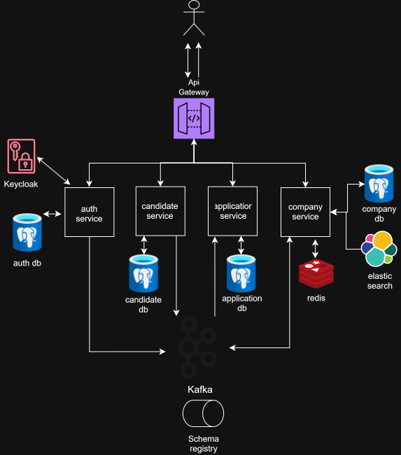

# TraineeMatch

Платформа для публикации и поиска вакансий стажировок.

## Архитектура



### Компоненты

- auth service - сервис аутентификации
- candidate service - сервис профилей и резюме кандидатов
- company service - сервис компаний, вакансий, hr-специалистов
- application service - сервис заявок, аналитики по откликам
- api gateway - апи шлюз для клиентов

### Event Driven Architecture

- Система разработана по событийно-ориентированной архитектуре
- Взаимодействие сервисов реализовано через брокер сообщений Apache Kafka
- Между сервисами отсутствуют синхронные вызовы
- Данный подход упрощает масштабирование отдельных компонент, повышает отказоустойчивость системы, обеспечивает слабую
  связанность между сервисами

---

## Основные сценарии

- Регистрация пользователей трех ролей: кандидат, hr-специалист, админ платформы
- Создание профиля кандидатом
- Создание резюме кандидатом
- Создание компании hr-специалистом
- Публикация вакансии hr-специалистом компании
- Поиск и просмотр опубликованных вакансий по ключевым словам и фильтрам
- Подача заявки кандидатом на вакансию
- Изменение статуса заявки hr-специалистом
- Просмотр базовой аналитики по заявкам

---

## Инфраструктура

- PostgreSQL - источник истины, у каждого сервиса своя бд, сервисы друг к другу в бд не ходят
- Apache Kafka - брокер сообщений, используется для межсервисного взаимодейтвия и как очередь
- Redis - кеширование запросов
- ElasticSearch - полнотекстовый поиск вакансий по названию, описанию, названию компании
- Keycloak - единая идентификация пользователей
- Nginx - api-gateway, балансировка запросов
- Confluent Schema Registry - хранение, эволюция авро-схем сообщений для кафки

---

## Особенности реализации

### Бэкенд сервисы

- Реализуют REST API
- Написаны на go
- Построены по чистой архитектуре (Clean Architecture)

### Интеграция с Kafka

- Outbox паттерн на продюсерах для at least once семантики
- Идемпотентная обработка на консюмерах для корректной обработки дубликатов сообщений
- Сообщения сериализуются в бинарный avro формат

Топики:

- vacancy.events
- company.events
- companymember.events
- user.events
- resume.events
- candidate.events

### Фронтенд

- Реализован на React + TypeScript + Vite
- Архитектура построена по Feature-Sliced Design: строгие восходящие зависимости между слоями (
  `app → pages → widgets → features → entities → shared`), контроль через ESLint boundaries
- API-клиент автогенерируется из Swagger-спецификаций бэкенда
- Аутентификация: cookie-based (HttpOnly), refresh-интерцептор с single-flight очередью
- Подробнее — [`/frontend/README.md`](/frontend/README.md)

## Тестирование

- Юнит тестирование основных бизнес сценариев
- End-to-end тестирование системы в общем

## Деплой

- В репозитории приведен пример развертывания через docker compose
- На данный момент все система развернута и работает на виртуальной машине
- Использовался let's encrypt для поддержки https
- Конфигурация приложения задается через переменные окружения контейнеров
- Frontend собирается в production-статику (Vite build) и раздаётся через nginx в Docker-контейнере


## Запуск

- Создайте .env файлы в папке каждого
  микросервиса ([api-gateway](backend/api-gateway), [auth](backend/auth), [application](backend/application), 
[candidate](backend/candidate), [company](backend/company), [frontend](frontend)) на основе существующих там `env.example` файлов
- Запустить бекенд часть через docker compose 
```bash
cd "trainee-match\backend"
docker-compose up -d
```
- Запустить фронтенд часть через docker compose
```bash
cd "trainee-match\frontend"
docker-compose up -d
```

---